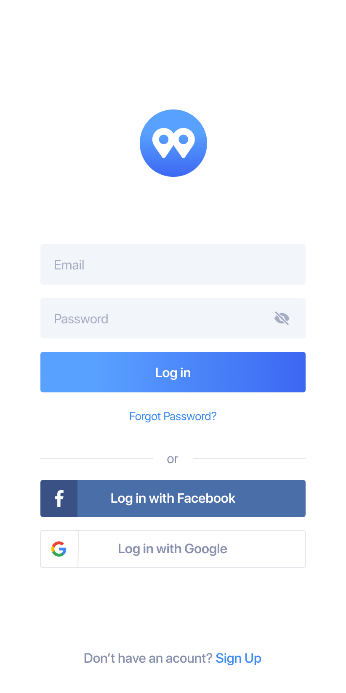
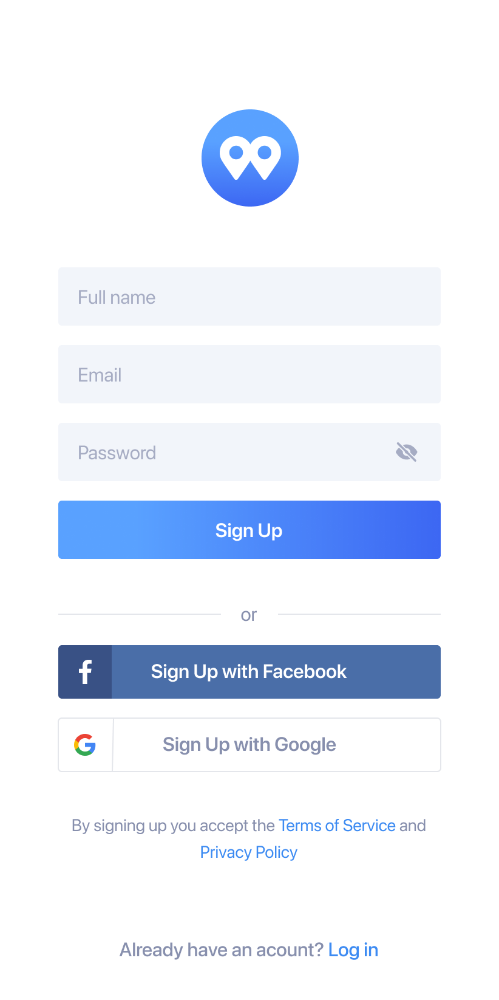
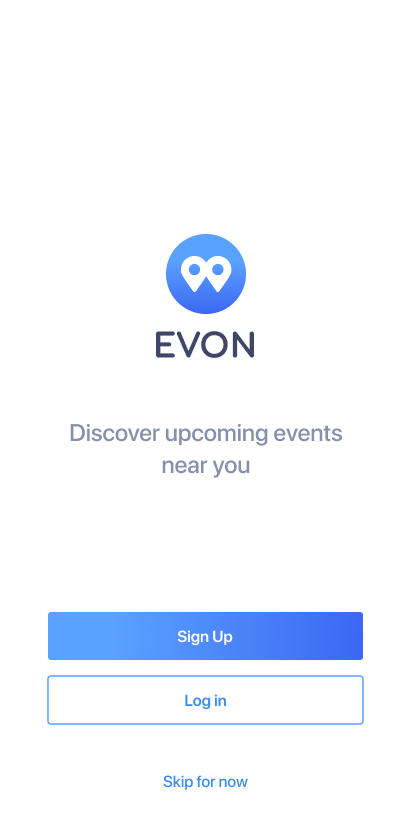

# Mobile Application registration screen.

## Welcome! 👋

Thank you for taking out time to check out this project.

**To complete this project, I made use of HTML and CSS**

## The Project

This is the final design put together by [Bahd Coder](https://twitter.com/bahdcoder) for developers(web) to try their hands on. I had a goal of completing everyone of them and I am so glad that I have successfully done that.

The project is a mobile application registration screen. The design was provided by [Bahd Coder](https://twitter.com/bahdcoder), I developed it making sure it looked as close to the design as possible.

I ensured the users were able to:

- See hover states for all interactive elements on the page
- View the site on various mobile screen sizes- 414px, 375px, 320px...
- view each page on a new tab of their browser.

During the course of completing the project, I refreshed some of my skills and learnt entirely new tricks on CSS, some of these tricks:

- Properly syling a form in CSS.
- Attributes of the form tag.
- Using a font family not linked with the HTML file. For the project, I could not find the font family used in the figma design on google fonts, so I had to download the font and import it to the CSS file using "@font-face". This was actually the first I had to do that for a project.

Generally, I had a nice time completing these challenges. Learnt a whole lot.

This is the link to the post on twitter containing the [challenges](https://twitter.com/bahdcoder/status/1363774758261768195)

🚀
